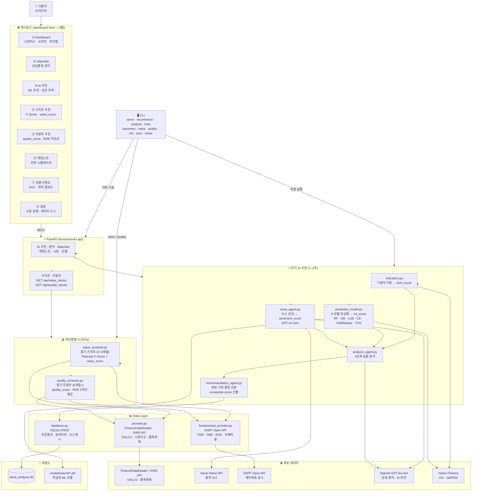
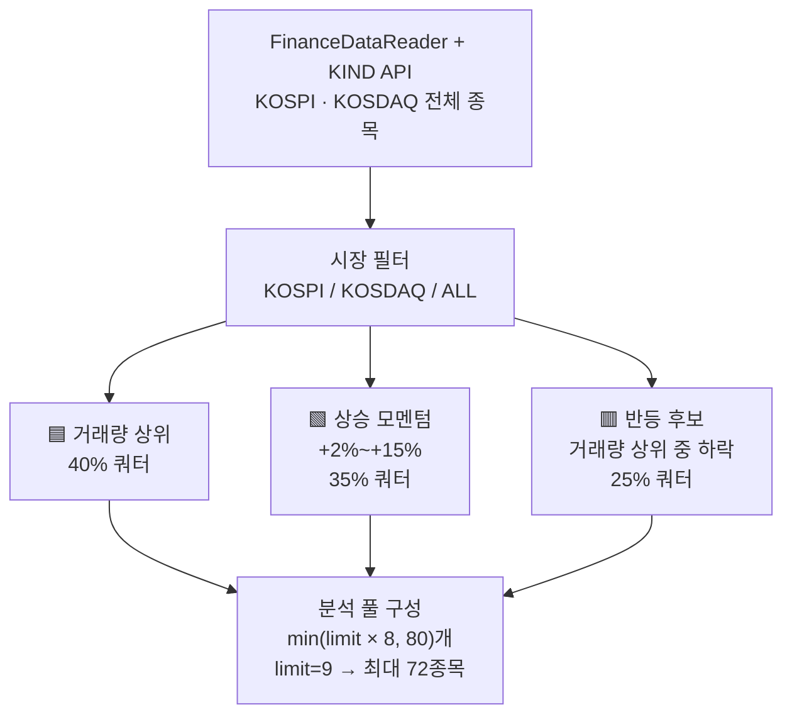
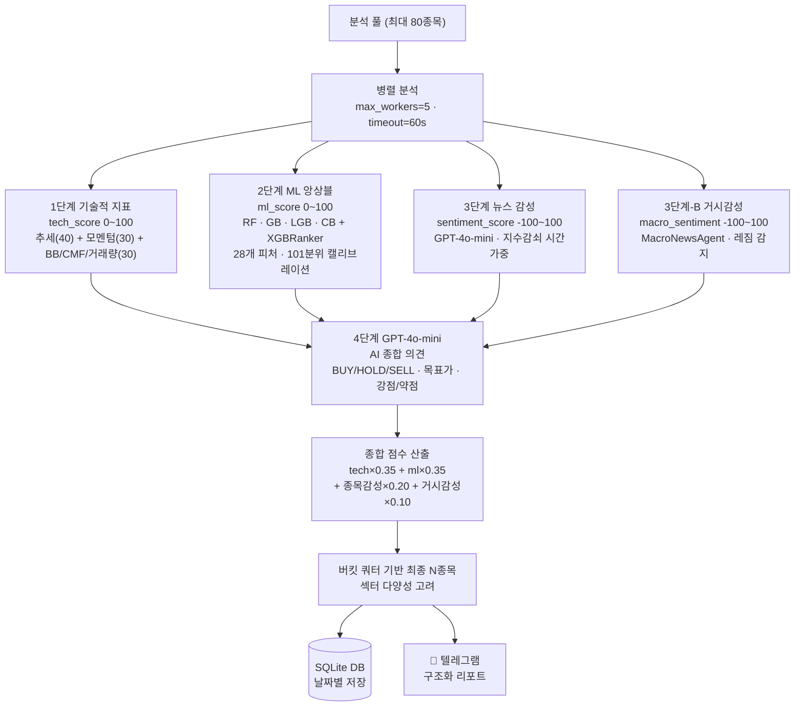
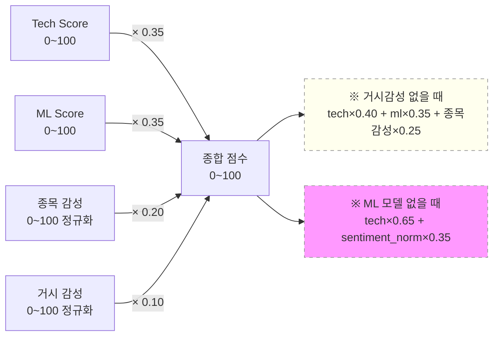
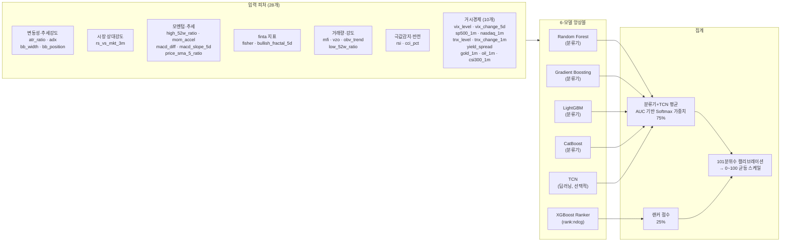
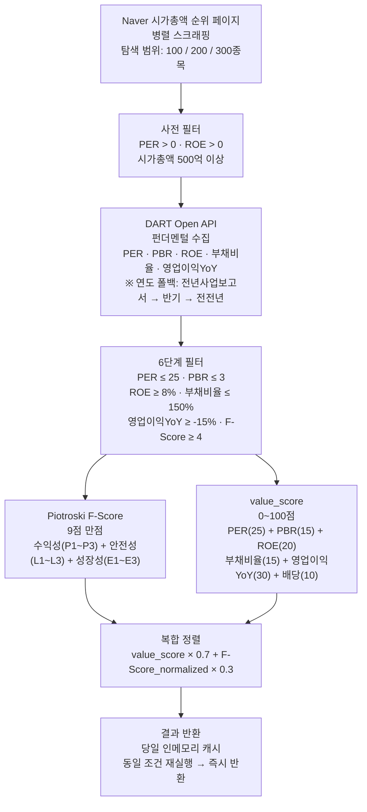
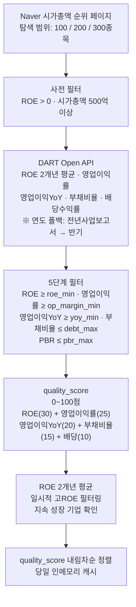
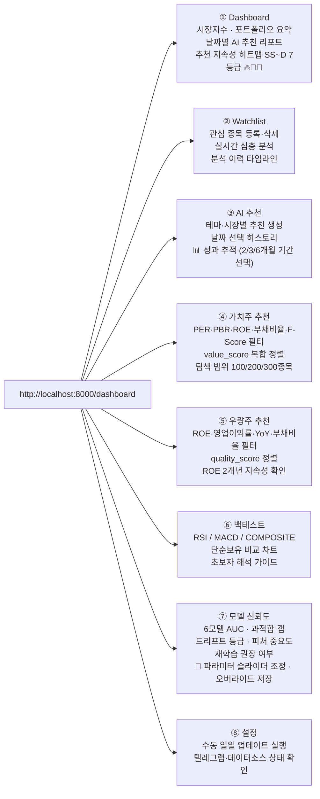
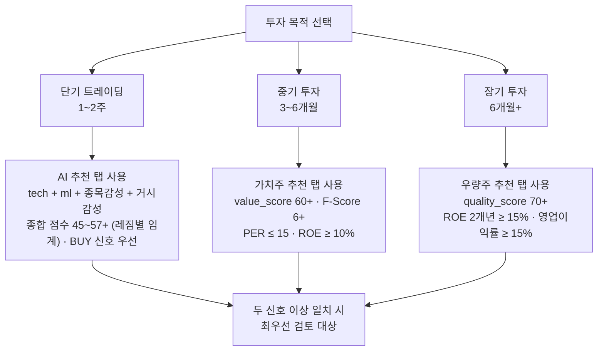
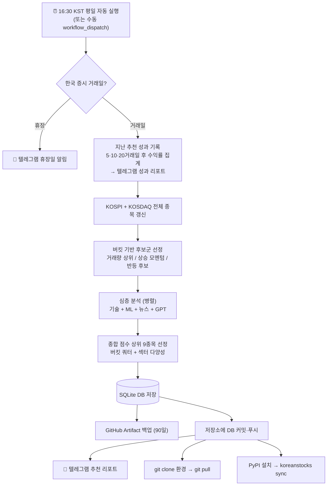

# 📈 Korean Stocks AI/ML Analysis System


> **KOSPI · KOSDAQ 종목을 AI와 머신러닝으로 분석하는 자동화 투자 보조 플랫폼**

---

## 목차

1. [프로젝트 소개](#-프로젝트-소개)
2. [주요 기능](#-주요-기능)
3. [기술 스택](#-기술-스택)
4. [시스템 아키텍처](#-시스템-아키텍처)
5. [분석 파이프라인](#-분석-파이프라인)
   - [단기 AI 추천](#단기-ai-추천-파이프라인-1-2주)
   - [ML 앙상블 모델](#2단계--ml-앙상블-ml_score-0-100)
   - [가치주 스크리닝](#가치주-스크리닝-파이프라인-중기-3-6개월)
   - [우량주 스크리닝](#우량주-스크리닝-파이프라인-장기-6개월)
6. [점수 체계](#-점수-체계-해석)
7. [대시보드 메뉴](#-대시보드-메뉴-구성-8탭)
8. [실전 투자 활용 가이드](#-실전-투자-활용-가이드)
9. [설치 및 실행](#-설치-및-실행)
10. [API 엔드포인트](#-api-엔드포인트)
11. [자동화 설정](#-자동화-설정-github-actions)
12. [변경 이력](#-변경-이력)
13. [면책 조항](#-면책-조항)

---

## 🚀 프로젝트 소개

`Korean Stocks AI/ML Analysis System`은 기술적 지표 분석, 머신러닝 예측, 뉴스 감성 분석을 통합하여 한국 주식 시장의 유망 종목을 자동으로 발굴하고 리포트를 생성하는 플랫폼입니다.

매일 장 마감 후 자동으로 실행되어 KOSPI·KOSDAQ 전 종목 중 **거래량 상위 · 상승 모멘텀 · 반등 후보** 버킷으로 분류된 종목을 스크리닝하고, 심층 분석 후 텔레그램으로 결과를 전송합니다.

단기 AI 추천 외에, DART 공시 기반 펀더멘털과 **Piotroski F-Score**를 활용한 **가치주 스크리닝**(중기 3~6개월), ROE·영업이익률·재무건전성 기반의 **우량주 스크리닝**(장기 6개월+)도 지원합니다.

---

## ✨ 주요 기능

| 기능 | 설명 |
|------|------|
| **AI 종목 추천** | 기술적 지표·ML·뉴스를 종합한 복합 점수로 유망 종목 선정 |
| **버킷 기반 선정** | 거래량 상위·상승 모멘텀·반등 후보 3개 버킷 쿼터 보장 (배지 UI 표시) |
| **날짜별 히스토리** | 과거 30일 분석 결과를 날짜 선택으로 조회 |
| **추천 지속성 히트맵** | SS~D 7등급 체계·연속/반복 배지(🔥🔄📌)·최신 점수 인라인·teal Cp 보더로 신호 신뢰도 시각화 |
| **DB 우선 조회 & 캐시** | 당일 저장된 DB 결과 우선 표시, 메뉴 이탈 후 재진입 시 세션 캐시 유지 |
| **DB 자동 동기화** | GitHub Actions 완료 후 DB를 저장소에 자동 커밋·푸시 → `koreanstocks sync` 한 번으로 최신 결과 반영 |
| **텔레그램 알림** | 종합점수 바·당일 등락률·RSI·뉴스 헤드라인·AI 강점 포함 구조화 리포트 발송 |
| **전략 백테스팅** | RSI · MACD · COMPOSITE 전략 시뮬레이션 (단순보유 비교, 초보자 해석 가이드 포함) |
| **관심 종목 관리** | Watchlist 등록 및 분석 이력 타임라인 제공 |
| **추천 성과 추적** | 5·10·20거래일 후 실제 수익률 자동 검증, 승률·목표가 달성률 통계 제공 (조회 기간: 2/3/6개월) |
| **가치주 스크리닝** | PER·PBR·ROE·부채비율·Piotroski F-Score 필터 + value_score 정렬, 당일 인메모리 캐시 |
| **우량주 스크리닝** | ROE·영업이익률·YoY성장·부채비율·PBR 필터 + quality_score 정렬, ROE 2개년 평균으로 지속성 확인 |
| **모델 신뢰도 대시보드** | ML 모델 AUC·과적합 갭·드리프트 등급·피처 중요도·재학습 권장 여부 확인 |

---

## 🛠 기술 스택

```
UI          FastAPI + Reveal.js (일일 브리핑) + Vanilla JS (인터랙티브 대시보드 8탭)
CLI         Typer (10개 명령어: serve / recommend / analyze / train / outcomes / value / quality / init / sync / home)
AI/LLM      OpenAI GPT-4o-mini (뉴스 감성 분석, AI 종합 의견)
ML          Scikit-learn (Random Forest, Gradient Boosting) + XGBoost Ranker + LightGBM + CatBoost
            + PyTorch TCN (선택적, pip install koreanstocks[dl])
            → 6-모델 앙상블 (분류기+TCN 75% + 랜커 25%, AUC 기반 Softmax 가중치)
기술 지표    ta (RSI, MACD, BB, SMA, OBV, ADX, VWAP, CMF, MFI, Stochastic, CCI, ATR, Donchian)
             + finta (SQZMI, VZO, Fisher Transform, Williams Fractal)
ML 피처     28개 (변동성·추세강도·시장 상대강도·모멘텀·finta·거래량·거시경제 10개·극값감지)
데이터       FinanceDataReader, KIND API (KRX 전종목), Naver News API, DART Open API (선택)
             Yahoo Finance (VIX·S&P500·NASDAQ·10Y금리·장단기스프레드·금·유가·CSI300)
DB          SQLite (data/storage/stock_analysis.db)
자동화       GitHub Actions (평일 16:30 KST), Telegram Bot API
시각화       Plotly, Matplotlib, Chart.js (백테스트 차트)
언어         Python 3.11 ~ 3.13
```

---

## 🏗 시스템 아키텍처

세 가지 독립적인 분석 파이프라인: **단기 AI 추천** · **중기 가치주 스크리닝** · **장기 우량주 스크리닝**



---

## 🔬 분석 파이프라인

### 단기 AI 추천 파이프라인 (1~2주)

#### 버킷 기반 후보군 선정



#### 종목별 심층 분석 (4단계 병렬)



#### 종합 점수 공식



> `sentiment_norm = (sentiment_score + 100) / 2`  → 0~100 정규화
> `macro_norm = (macro_sentiment_score + 100) / 2`  → 0~100 정규화

---

### 2단계 — ML 앙상블 (ml_score, 0~100)

#### 6-모델 앙상블 구조



**ML 학습 설정:**
- **타깃:** 10거래일 후 수익률 상위 25% = 1 / 하위 25% = 0 (중간 50% neutral zone 제외)
- **Walk-Forward CV:** VAL_STEP=10 거래일, 약 48 fold, Purging 20 거래일
- **품질 게이트:** test_AUC ≥ 0.52 통과 시에만 저장 (미통과 시 tech_score 폴백)

---

### 가치주 스크리닝 파이프라인 (중기 3~6개월)



#### Piotroski F-Score 구성 (9점)

| 구분 | 항목 | 기준 |
|------|------|------|
| **수익성 (P1~P3)** | P1 ROA | 당기순이익 / 총자산 > 0 |
| | P2 영업현금흐름 | 영업이익 > 0 |
| | P3 ROA 개선 | 전년 대비 ROA 증가 |
| **안전성 (L1~L3)** | L1 부채비율 감소 | 전년 대비 부채비율 하락 |
| | L2 유동비율 개선 | 부채비율 하락 (대리지표) |
| | L3 무상증자 없음 | PBR 정상 범위 |
| **성장성 (E1~E3)** | E1 영업이익률 개선 | 전년 대비 영업이익률 상승 |
| | E2 자산회전율 개선 | 전년 대비 매출/총자산 증가 |
| | E3 OCF > 순이익 | 영업이익YoY > 5% (대리지표) |

---

### 우량주 스크리닝 파이프라인 (장기 6개월+)



---

## 📊 점수 체계 해석

### Tech Score (기술적 지표 종합, 0~100)

| 점수 | 해석 |
|------|------|
| 80–100 | 매우 강세 |
| 60–79 | 강세 |
| 40–59 | 중립 |
| 0–39 | 약세 |

**세부 구성 (합계 100점)**

| 구성 | 최대 | 주요 지표 |
|------|------|-----------|
| ① 추세 | 40점 | SMA5/20/60, MACD 골든크로스, ADX DI+/DI− |
| ② 모멘텀 | 30점 | RSI × MACD 방향 맥락 보정, BB 폭 보정 |
| ③ 위치·자금흐름 | 30점 | BB 위치(20), CMF(5), 거래량 확인(5) |

> MACD 방향에 따라 RSI 최적 구간이 반전됩니다 (상승추세: 55~75 최적 / 하락추세: 35~50 최적).

---

### ML Score (머신러닝 예측, 0~100)

10거래일 후 수익률 **상위 25% 진입 확률**의 캘리브레이션 점수.

| 점수 | 해석 |
|------|------|
| 70–100 | 강한 상승 기대 (상위 25% 고확률) |
| 50–69 | 중간 이상 — 양호 |
| 30–49 | 중립~약세 |
| 0–29 | 하위권 예상 |

---

### News Sentiment Score (뉴스 감성, -100~100)

| 점수 | 해석 |
|------|------|
| 51–100 | Very Bullish (매우 긍정) |
| 1–50 | Bullish (긍정) |
| 0 | Neutral |
| -49~-1 | Bearish (부정) |
| -100~-50 | Very Bearish (매우 부정) |

---

### Value Score (가치주, 0~100)

| 항목 | 배점 | 최고점 기준 |
|------|------|------------|
| PER | 25pt | 업종 중앙값 기준 상대 평가 |
| PBR | 15pt | 낮을수록 최고 / 3.0 이상 0pt |
| ROE | 20pt | ≥ 30% 최고 (2개년 평균) |
| 부채비율 | 15pt | 낮을수록 최고 / 150% 이상 0pt |
| 영업이익YoY | 30pt | ≥ +30% 최고 / -30% 이하 0pt |
| 배당수익률 | 10pt | ≥ 3% 최고 (데이터 없으면 제외) |

**복합 정렬:** `value_score × 0.7 + (F-Score / 9 × 100) × 0.3`

| value_score | 해석 |
|-------------|------|
| 70–100 | 우수한 저평가 종목 — 중기 매수 검토 대상 |
| 50–69 | 양호 — 추가 검증 후 판단 |
| 30–49 | 보통 — 일부 지표 취약 |
| 0–29 | 미달 |

---

### Quality Score (우량주, 0~100)

| 항목 | 배점 | 최고점 기준 |
|------|------|------------|
| ROE | 30pt | ≥ 20% 최고 (2개년 평균) |
| 영업이익률 | 25pt | ≥ 20% 최고 |
| 영업이익YoY | 20pt | ≥ 30% 최고 |
| 부채비율 | 15pt | 낮을수록 최고 / 100% 이상 0pt |
| 배당수익률 | 10pt | ≥ 3% 최고 |

| quality_score | 해석 |
|---------------|------|
| 70–100 | 최우량 — 장기 핵심 보유 후보 |
| 50–69 | 양호 — 장기 투자 검토 대상 |
| 30–49 | 보통 — 추가 검증 필요 |
| 0–29 | 미달 |

---

## 🖥 대시보드 메뉴 구성 (8탭)

> **권장 브라우저: Chrome / Firefox (최신 버전)**



| 탭 | 주요 기능 | 투자 관점 |
|----|----------|-----------|
| **Dashboard** | 시장지수, AI 추천, 히트맵 | 당일 현황 파악 |
| **Watchlist** | 관심종목 관리, 분석 이력 | 지속 모니터링 |
| **AI 추천** | ML 추천 생성, 성과 추적 | 단기 1~2주 |
| **가치주 추천** | F-Score + value_score 스크리닝 | 중기 3~6개월 |
| **우량주 추천** | quality_score 스크리닝 | 장기 6개월+ |
| **백테스트** | 전략별 과거 성과 시뮬레이션 | 전략 검증 |
| **모델 신뢰도** | ML 모델 헬스체크 · 파라미터 조정 | 신호 신뢰성 판단 · 과적합 완화 |
| **설정** | 수동 실행, 환경 설정 확인 | 운영 관리 |

### 🔧 모델 파라미터 조정 (모델 신뢰도 탭)

과적합 갭이 크거나 CV 성능이 불안정한 모델에 대해 **재학습 없이 파라미터를 미리 조정**하고 저장할 수 있다.

```
① 모델 카드 하단 [파라미터 조정 ▼] 클릭
   → 현재 학습에 사용된 파라미터값 표시 (models/saved/model_params/*.json 기준)
   → 오버라이드 적용 중이면 🔧 오버라이드 적용 중 배지 표시

② 슬라이더 / 입력란으로 값 조정
   조정 가능 파라미터 (모델별):
   ┌─────────────────┬────────────────────────────────────────────────────┐
   │ CatBoost        │ depth (2~6), l2_leaf_reg (1~20), min_data_in_leaf (20~100) │
   │ LightGBM        │ max_depth (1~4), min_child_samples (50~200), reg_lambda (1~15) │
   │ XGBoost Ranker  │ max_depth (2~5), min_child_weight (15~60), reg_lambda (1~10) │
   │ Random Forest   │ max_depth (3~8), min_samples_leaf (15~60)                │
   │ Gradient Boost  │ max_depth (1~4), min_samples_leaf (15~60)                │
   └─────────────────┴────────────────────────────────────────────────────┘

③ [오버라이드 저장] 클릭
   → models/saved/model_params/{name}_overrides.json 에 저장
   → 다음 `koreanstocks train` 실행 시 학습 파라미터에 자동 병합

④ [오버라이드 초기화] 클릭
   → 오버라이드 파일 삭제, 원래 파라미터 복원
```

> **과적합 갭 완화 예시**: CatBoost val-train AUC 갭이 0.10 이상이면 `depth 3→2`, `min_data_in_leaf 40→60`으로 조정 후 재학습.

---

## 💡 실전 투자 활용 가이드

> ⚠️ 본 시스템은 **투자 보조 도구**입니다. 최종 투자 결정은 반드시 본인이 직접 판단하세요.

### 투자 시계 (Investment Horizon) 선택



### 단기 AI 추천 활용 단계별 가이드

```
Step 1 — 스크리닝 (매일 자동)
  → 텔레그램 알림으로 오늘의 추천 9종목 확인
  → 종합 점수 상위 2~3종목을 후보로 선정

Step 2 — 지속성 확인 (신뢰도 검증)
  → 추천 지속성 히트맵에서 연속 추천 일수 확인
  → 🔥 (연속 2일+) 배지 종목은 신호 신뢰도 높음

Step 3 — 성과 데이터 확인
  → AI 추천 탭 → "추천 성과 추적" 섹션
  → 과거 추천의 5·10·20거래일 승률 · 목표가 달성률 확인

Step 4 — 심층 검증 (수동)
  → Dashboard 또는 AI 추천 탭 상세 리포트 확인
  → 강점/약점, 뉴스 원문 링크, 목표가 근거 직접 검토
  → 백테스트 탭에서 해당 전략의 과거 성과 확인

Step 5 — 최종 판단 기준
  아래 조건 중 2개 이상 충족 시 매수 검토 ✅
  ✓ 최근 5일 거래량 ≥ 20일 평균의 150%
  ✓ 52주 저점 대비 -20% 이내
  ✓ 뉴스 감성 Bullish 이상 (score > 20)
  ✓ 추천 지속성 히트맵 🔥 배지 (연속 2일+)
  ✓ ML Score ≥ 60 + Tech Score ≥ 65
```

### 강력 매수 후보 판단 기준

```
강력 매수 후보 (모든 조건 충족 시)
  ✅ Tech Score ≥ 65
  ✅ ML Score ≥ 60
  ✅ News Score > 20
  ✅ AI action = BUY
  ✅ RSI: 35~50 구간 (과매도 탈출 또는 중립 하단)
  ✅ MACD: 골든크로스 발생 또는 유지

관망 권고
  ✗ Tech < 50 이고 MACD 데드크로스 상태
  ✗ News Score < -30 (강한 악재 뉴스)
  ✗ RSI > 75 (과열 구간)

매도 검토
  ✗ AI action = SELL + Tech Score < 40
  ✗ RSI > 75 + MACD 데드크로스 동시 발생
```

### 리스크 관리 원칙

| 원칙 | 설명 |
|------|------|
| **분산 투자** | 동일 섹터에 몰리지 않도록 1~2종목만 선택 |
| **손절 기준** | 매수가 대비 7~8% 하락 시 손절 고려 |
| **비중 관리** | 단일 종목에 총 자산의 10% 이상 집중 지양 |
| **재검증** | 매수 후 3~5일 내 재분석으로 의견 변화 모니터링 |

---

## ⚙️ 설치 및 실행

### 방법 A — PyPI 설치 (권장: 분석 결과 조회 전용)

분석 실행 없이 GitHub Actions가 생성한 추천 결과를 대시보드로 조회할 때 사용합니다.

```bash
# 시스템 라이브러리 (XGBoost / LightGBM 구동에 필요)
sudo apt-get install -y libomp-dev   # Ubuntu / Debian
# brew install libomp               # macOS

pip install koreanstocks             # 기본 설치 (TCN 비활성화)
pip install "koreanstocks[dl]"       # TCN 딥러닝 앙상블 포함 (~700MB)
```

```bash
koreanstocks init    # API 키 대화형 설정
koreanstocks sync    # GitHub Actions 생성 DB 다운로드
koreanstocks serve   # http://localhost:8000/dashboard 자동 열림
```

> `.env`·DB·ML 모델은 `~/.koreanstocks/`에 저장됩니다.

#### pipx로 설치 (CLI 격리 권장)

```bash
pip install pipx && pipx ensurepath
pipx install koreanstocks          # 기본 설치 (TCN 비활성화)
```

TCN 딥러닝 앙상블을 활성화하려면 (선택적, ~700MB):

```bash
# 방법 A: 처음부터 dl extra 포함 설치 (권장)
pipx install "koreanstocks[dl]"

# 방법 B: 이미 설치한 경우 inject
pipx inject koreanstocks torch

# 방법 C: 이미 설치되어 있고 dl extra를 추가하려면 --force 재설치
pipx install "koreanstocks[dl]" --force
```

GPU(CUDA) 환경에서 torch CUDA 버전으로 교체하려면:

```bash
pipx install koreanstocks
pipx inject koreanstocks torch --index-url https://download.pytorch.org/whl/cu121
```

> **주의**: pipx는 격리 venv를 사용하므로 `pip install koreanstocks[dl]`로는 TCN을 활성화할 수 없습니다. 반드시 위 pipx 방식을 사용하세요.

---

### 방법 B — 저장소 클론 (개발 / 자체 분석 실행)

```bash
git clone https://github.com/bullpeng72/KoreanStock.git
cd KoreanStock

conda create -n stocks_env python=3.11
conda activate stocks_env

sudo apt-get install -y libomp-dev   # Ubuntu/Debian
pip install -e .                     # editable 설치 (TCN 비활성화)
pip install -e ".[dl]"               # TCN 딥러닝 앙상블 포함 (~700MB)
```

---

### API 키 설정 — `koreanstocks init`

```bash
koreanstocks init                   # 대화형 입력 (권장)
koreanstocks init --non-interactive  # 빈 템플릿 생성 (CI용)
```

#### 환경 변수 목록

```ini
# ── 필수 ──────────────────────────────────────────────────────
OPENAI_API_KEY=sk-proj-...         # GPT-4o-mini 뉴스 감성·AI 의견
NAVER_CLIENT_ID=abc123             # Naver News API
NAVER_CLIENT_SECRET=xyz789
TELEGRAM_BOT_TOKEN=123456:ABC-...  # 추천 리포트 발송
TELEGRAM_CHAT_ID=-1001234567890

# ── 선택 ──────────────────────────────────────────────────────
DART_API_KEY=                      # 미설정 시 뉴스만으로 감성 분석

# ── 시스템 (기본값 사용 권장) ──────────────────────────────────
DB_PATH=data/storage/stock_analysis.db
# KOREANSTOCKS_BASE_DIR=           # 데이터 루트 경로 강제 지정
# KOREANSTOCKS_GITHUB_DB_URL=      # fork 시 sync URL 재정의
```

| 변수 | 발급처 | 필수 |
|------|--------|:----:|
| `OPENAI_API_KEY` | [platform.openai.com/api-keys](https://platform.openai.com/api-keys) | ✅ |
| `NAVER_CLIENT_ID/SECRET` | [developers.naver.com](https://developers.naver.com) — 검색 API | ✅ |
| `TELEGRAM_BOT_TOKEN` | 텔레그램 [@BotFather](https://t.me/BotFather) → `/newbot` | ✅ |
| `TELEGRAM_CHAT_ID` | `api.telegram.org/bot<TOKEN>/getUpdates` | ✅ |
| `DART_API_KEY` | [opendart.fss.or.kr](https://opendart.fss.or.kr) (무료) | ☑️ |

---

### 주요 CLI 명령어

```bash
# 웹 대시보드
koreanstocks serve                     # http://localhost:8000/dashboard
koreanstocks serve --port 8080         # 포트 변경
koreanstocks serve --no-browser        # 브라우저 자동 실행 비활성화

# 일일 추천 분석 (GitHub Actions용)
koreanstocks recommend
koreanstocks recommend --market KOSPI --limit 10

# 단일 종목 심층 분석
koreanstocks analyze 005930

# ML 모델 재학습
koreanstocks train
koreanstocks train --period 2y --future-days 10

# DB 동기화 (PyPI 설치 환경)
koreanstocks sync              # 최초 수신 또는 날짜 갱신
koreanstocks sync --force      # 강제 덮어쓰기

# 추천 성과 추적
koreanstocks outcomes                  # 미검증 결과 업데이트 + 통계 출력
koreanstocks outcomes --days 180       # 최근 180일 조회
koreanstocks outcomes --no-record      # DB 업데이트 없이 통계만

# 가치주 스크리닝 (중기 3~6개월)
koreanstocks value                     # 기본 필터 (상위 20종목)
koreanstocks value --per-max 15 --roe-min 10
koreanstocks value --f-score-min 6 --candidate-limit 300

# 우량주 스크리닝 (장기 6개월+)
koreanstocks quality                   # 기본 필터 (상위 20종목)
koreanstocks quality --roe-min 15 --margin-min 15
koreanstocks quality --market KOSPI --candidate-limit 200

# 데이터 홈 디렉토리
koreanstocks home                      # 경로 출력
koreanstocks home --open               # 파일 탐색기로 열기
koreanstocks home --setup              # 셸 alias 스니펫 출력

# 테스트
pytest tests/
python tests/compat_check.py          # Python 3.11~3.13 호환성 검증
```

---

## 📡 API 엔드포인트

서버 실행 후 `/docs`에서 Swagger UI로 전체 API 문서를 확인할 수 있습니다.

| 라우터 | 엔드포인트 | 메서드 | 설명 |
|--------|-----------|--------|------|
| **market** | `/api/market` | GET | 시장 지수 (KS11/KQ11) |
| | `/api/market/trading-day` | GET | 거래일 여부 확인 |
| | `/api/market/ranking` | GET | 시장 등락 순위 |
| **recommendations** | `/api/recommendations` | GET | 날짜별 추천 목록 |
| | `/api/recommendations/run` | POST | 추천 분석 실행 |
| | `/api/recommendations/history` | GET | 30일 히스토리 |
| | `/api/recommendations/outcomes` | GET | 성과 추적 통계 |
| **analysis** | `/api/analysis/{code}` | GET/POST | 종목 심층 분석 |
| | `/api/analysis/{code}/history` | GET | 분석 이력 타임라인 |
| **watchlist** | `/api/watchlist` | GET/POST | 관심 종목 조회/등록 |
| | `/api/watchlist/{code}` | DELETE | 관심 종목 삭제 |
| **backtest** | `/api/backtest` | GET | 전략 백테스팅 |
| **value** | `/api/value_stocks` | GET | 가치주 스크리닝 결과 |
| | `/api/value_stocks/filters` | GET | 필터 기본값 |
| **quality** | `/api/quality_stocks` | GET | 우량주 스크리닝 결과 |
| | `/api/quality_stocks/filters` | GET | 필터 기본값 |
| **models** | `/api/model_health` | GET | ML 모델 헬스체크 |
| | `/api/model_params/{name}` | GET | 학습 파라미터 + 오버라이드 조회 |
| | `/api/model_params/{name}` | POST | 파라미터 오버라이드 저장 |
| | `/api/model_params/{name}/override` | DELETE | 오버라이드 초기화 |
| | `/api/macro_context` | GET | 거시경제 레짐·감성·요약 |
| **version** | `/api/version` | GET | API 버전 정보 |

---

## 🤖 자동화 설정 (GitHub Actions)

**실행 시점:** 평일 오후 16:30 KST (UTC 07:30) — 장 마감 후 자동 실행



**GitHub Secrets 등록 (Settings > Secrets and variables > Actions):**

```
OPENAI_API_KEY
TELEGRAM_BOT_TOKEN
TELEGRAM_CHAT_ID
NAVER_CLIENT_ID
NAVER_CLIENT_SECRET
DART_API_KEY          (선택)
```

---

## 📁 프로젝트 구조

```
KoreanStocks/
├── pyproject.toml                       # pip 빌드 설정 (koreanstocks CLI 진입점)
├── requirements.txt                     # 개발/테스트 전용 (pytest 등)
├── train_models.py                      # ML 모델 재학습 스크립트
├── src/
│   └── koreanstocks/
│       ├── __init__.py                  # VERSION = "0.5.3"
│       ├── cli.py                       # Typer CLI (10개 명령어)
│       ├── api/
│       │   ├── app.py                   # FastAPI 앱 팩토리
│       │   ├── dependencies.py          # 공통 의존성
│       │   └── routers/
│       │       ├── recommendations.py   # AI 추천 · 성과 추적
│       │       ├── analysis.py          # 종목 심층 분석
│       │       ├── watchlist.py         # 관심 종목 CRUD
│       │       ├── backtest.py          # 전략 백테스팅
│       │       ├── market.py            # 시장 지수 · 거래일
│       │       ├── models.py            # ML 모델 헬스체크
│       │       ├── value.py             # 가치주 스크리닝
│       │       └── quality.py           # 우량주 스크리닝
│       ├── static/
│       │   ├── index.html               # Reveal.js 일일 브리핑 슬라이드
│       │   ├── dashboard.html           # 인터랙티브 대시보드 (8탭)
│       │   ├── js/
│       │   │   ├── slides.js
│       │   │   └── dashboard.js
│       │   └── css/theme.css
│       └── core/
│           ├── config.py                # 환경변수 및 설정 (dotenv)
│           ├── constants.py             # 버킷 상수 등 공유 상수
│           ├── data/
│           │   ├── provider.py              # 주가 · 종목목록 수집
│           │   ├── fundamental_provider.py  # DART 펀더멘털 수집
│           │   └── database.py              # SQLite CRUD
│           ├── engine/
│           │   ├── indicators.py            # 기술적 지표 계산
│           │   ├── features.py              # ML 피처 추출 (20개, 공유)
│           │   ├── strategy.py              # 전략별 시그널 생성
│           │   ├── prediction_model.py      # 6-모델 앙상블 추론 (트리 5 + TCN)
│           │   ├── news_agent.py            # 뉴스 수집 + GPT 감성
│           │   ├── analysis_agent.py        # 종목 심층 분석 오케스트레이터
│           │   ├── recommendation_agent.py  # 버킷 기반 추천 생성
│           │   ├── value_screener.py        # 가치주 스크리닝 (F-Score + value_score)
│           │   ├── quality_screener.py      # 우량주 스크리닝 (quality_score)
│           │   ├── trainer.py               # ML 모델 재학습 워크플로우
│           │   └── scheduler.py             # 자동화 워크플로우
│           └── utils/
│               ├── backtester.py        # 전략 성과 검증
│               ├── notifier.py          # 텔레그램 리포트
│               └── outcome_tracker.py   # 추천 결과 성과 추적
├── models/saved/                        # 학습된 ML 모델 (.pkl) · 파라미터 (.json)
├── data/storage/                        # SQLite DB 파일
├── docs/
│   ├── ML_ANALYSIS.md                   # ML 앙상블 시스템 기술 문서
│   ├── TECHNICAL_ANALYSIS.md            # 기술적 분석 시스템 기술 문서
│   ├── NEWS_ANALYSIS.md                 # 뉴스 감성 분석 시스템 기술 문서
│   ├── VALUE_SCREENING.md               # 가치주 스크리닝 기술 문서
│   └── QUALITY_SCREENING.md             # 우량주 스크리닝 기술 문서
├── tests/
│   ├── test_backtester.py               # 백테스터 단위 테스트
│   └── compat_check.py                  # Python 3.11~3.13 호환성 검증
└── .github/workflows/
    └── daily_analysis.yml               # GitHub Actions 스케줄러
```

---

## 📝 변경 이력

### v0.5.4 (2026-03-17) — 기술 부채 해소 · 브리핑 UI 개선 · 서버 안정성 강화

- 🔧 기술 부채 해소: `quality_screener` 이중 슬라이싱 버그 · `prediction_model` 매직 넘버 상수화 + `_parse_calibration()` 헬퍼 · `trainer` `_fetch_stock_base()` 공통 헬퍼 · `constants` 가중치 상수화 · `provider` URL 상수화
- 🐛 `outcome_tracker`: `socket.setdefaulttimeout()` → `ThreadPoolExecutor` 격리 타임아웃 + `BaseException` 래퍼 — `/api/macro_context` 이후 서버 크래시 근본 수정
- 🐛 `app.py`: `/favicon.ico` 404 → 204 · `Cache-Control: no-store`
- ✨ `slides.js` v4: 마지막 슬라이드 "종합 요약" 테이블 (종목·시그널·점수·상승여력·RSI·MACD) · 표지 대시보드 링크 제거
- ✨ `dashboard.html`: 브리핑·API 링크 새 창 분리 (`target="_blank"`)
- ✨ GitHub Actions `pre_check` 잡: 동일일 이중 실행 방지

### v0.5.3 (2026-03-16) — 모델 파라미터 조정 UI 프론트 구현 완성

- ✨ 신뢰도 향상 방안 대상 모델에만 ⚙ 파라미터 조정 버튼 표시 (`overfit_gap > 0.10` 또는 `cv_auc_std > 0.05`)
- ✨ 슬라이더 2행 레이아웃 — 파라미터명 + `기존: N` + 조정값 표기, 카드 내 오버플로 수정
- ✨ 💾 저장 / 🔄 초기화 즉시 반영 (`POST/DELETE /api/model_params/{name}`)

### v0.5.2 (2026-03-16) — 기술 부채 해소 · 상수 중앙화 · 단위 테스트 추가

- 🔧 매직넘버 `constants.py` 중앙화, `trainer.py` 분해, `quality_screener.py` O(n²)→O(1) 최적화
- 🐛 Sharpe 계산 왜곡·중복 인덱스 방어·`sync` URL 오타 수정
- ✨ `tests/test_core.py` 단위 테스트 29개 추가

### v0.5.1 (2026-03-16) — 모델 파라미터 API · 신뢰도 향상 방안 카드

- ✨ `GET/POST/DELETE /api/model_params/{name}` — 파라미터 오버라이드 CRUD, 서버 측 범위 검증
- ✨ 신뢰도 향상 방안 카드 — 모델별 구체적 조치 텍스트 (과적합 갭·레짐 갭·CV 불안정)
- 🐛 `dashboard.js` DOM 재직렬화 버그 수정, `trainer.py` overrides 자동 merge 추가

### v0.5.0 (2026-03-13) — 거시경제 통합 · ML 28피처

- ✨ `macro_news_agent.py`: 거시 뉴스 감성 + 레짐 감지 (`risk_on` / `uncertain` / `risk_off`)
- ✨ ML 피처 20 → 28개 (VIX·금리·나스닥·금·원유·CSI300 추가), 종합 점수 거시감성 10% 반영
- ✨ `GET /api/macro_context`, 대시보드 레짐 배너·배지 UI 추가
- 🐛 `trainer._fetch_macro_data()` 2심볼 → 8심볼 (피처 중요도 0% 버그 해결)

### v0.4.x (2026-03-06 ~ 2026-03-12) — 가치·우량주 스크리너 · TCN 딥러닝 앙상블 · 히트맵 · 안정성 강화

- ✨ `가치주 추천` 탭 — PER·PBR·ROE·F-Score 필터 + `koreanstocks value` CLI + `GET /api/value_stocks`
- ✨ `우량주 추천` 탭 — ROE·영업이익률·YoY성장 필터 + `koreanstocks quality` CLI + `GET /api/quality_stocks`
- ✨ `tcn_model.py` 신규: Dilated Causal Conv1D TCN — 6-모델 앙상블 완성 (RF · GB · LGB · CB · XGBRanker · TCN)
- ✨ 추천 지속성 히트맵 — 7등급 체계(SS/S/A/B/Cp/C/D), 연속 추천 배지, 5단계 정렬 tiebreaker
- ✨ 추천 성과 Collapse UI, 성과 탭 자동 재시도, `target_hit` 소급 집계
- 🔧 ML 피처 17→20개 (`obv_trend`, `rsi`, `cci_pct`), Walk-Forward CV 강화, TCN 과적합 억제
- 🔧 FDR DataReader read timeout 전역 패치 — 학습 수집 hang 해결
- 🔧 pipx 환경 감지 → `pipx inject koreanstocks torch` 안내 자동 출력
- 🐛 pandas·yfinance FutureWarning 전면 제거, `SettingWithCopyWarning` 수정
- 🐛 `fundamental_provider.py` DART 재작성 — ROE·부채비율 대차대조표 직접 계산

### v0.3.x (2026-02-28 ~ 2026-03-05) — 추천 성과 추적 · 5-모델 앙상블 · pykrx 제거

- ✨ 추천 성과 추적 (5·10·20거래일 후 실적 검증, `outcomes` CLI 및 Web UI)
- ✨ 버킷 배지 UI (거래량 상위/상승 모멘텀/반등 후보) — 대시보드·슬라이드 동시 반영
- ✨ LightGBM · CatBoost 추가 → 5-모델 앙상블
- ✨ XGBoost 이진 분류 → XGBRanker (rank:ndcg) 교체
- ✨ `/api/version` 엔드포인트 신설
- 🔧 pykrx 완전 제거 → FinanceDataReader + KIND API

---

## ⚠️ 면책 조항

본 소프트웨어는 **교육 및 정보 제공 목적**으로만 제작되었습니다.

- 본 시스템의 분석 결과는 투자 권유 또는 금융 조언이 아닙니다.
- AI 및 ML 모델의 예측은 미래 수익을 보장하지 않습니다.
- 주식 투자에는 원금 손실의 위험이 있습니다.
- 최종 투자 결정과 그에 따른 손익은 전적으로 투자자 본인에게 있습니다.

---

## 📄 라이선스

이 프로젝트는 [MIT License](LICENSE)를 따릅니다.

---

*(C) 2026. All rights reserved.*
