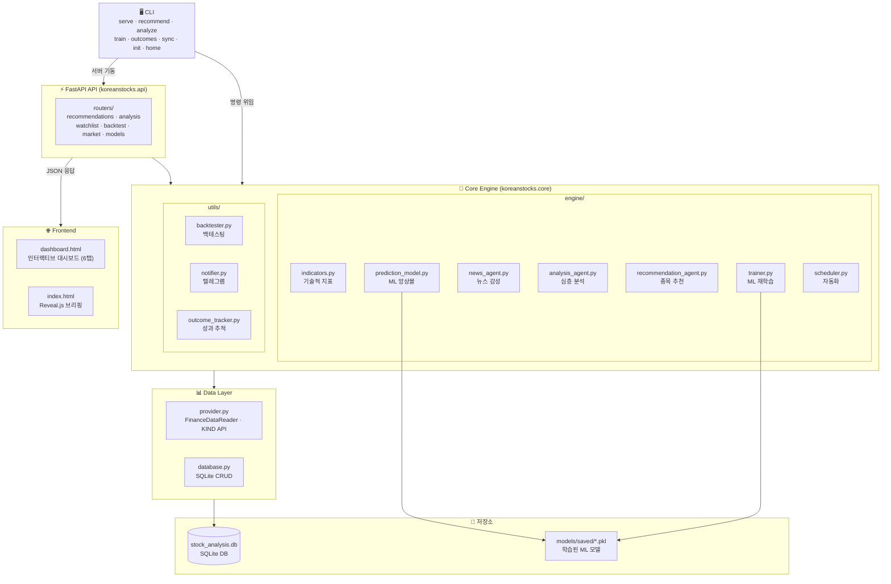
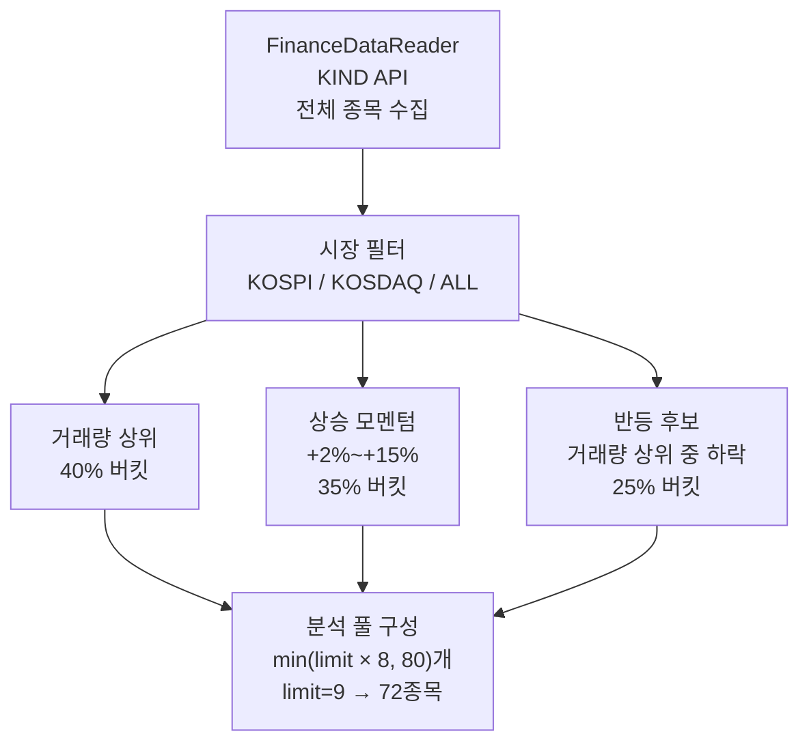
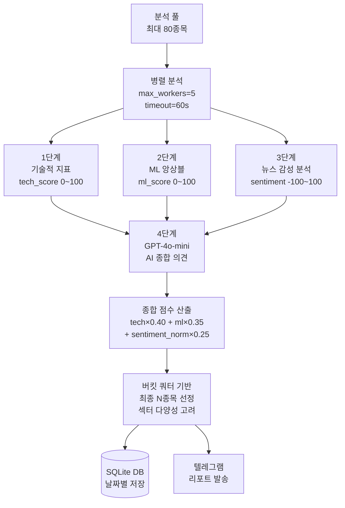
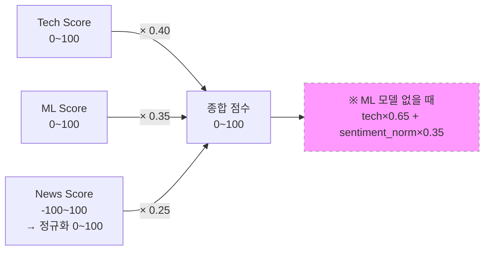
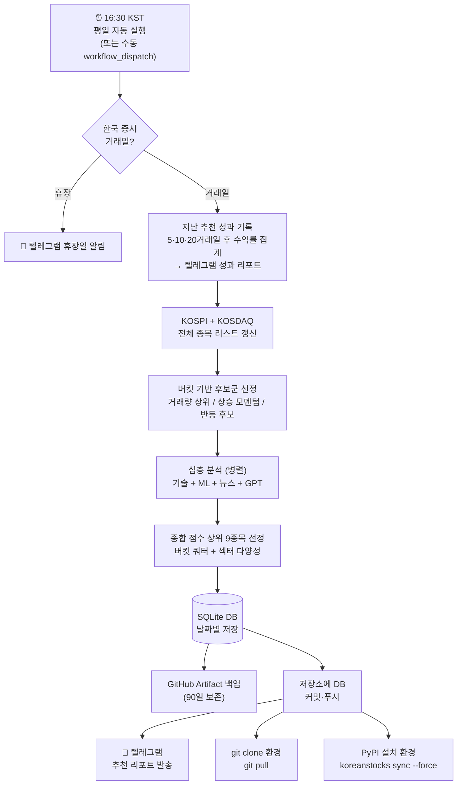

# 📈 Korean Stocks AI/ML Analysis System


> **KOSPI · KOSDAQ 종목을 AI와 머신러닝으로 분석하는 자동화 투자 보조 플랫폼**

---

## 목차
1. [프로젝트 소개](#-프로젝트-소개)
2. [주요 기능](#-주요-기능)
3. [기술 스택](#-기술-스택)
4. [시스템 아키텍처](#-시스템-아키텍처)
5. [분석 파이프라인](#-분석-파이프라인)
6. [점수 체계 해석](#-점수-체계-해석)
7. [실전 투자 활용 가이드](#-실전-투자-활용-가이드)
8. [설치 및 실행](#-설치-및-실행)
   - [방법 A — PyPI 설치](#방법-a--pypi-설치-권장-분석-결과-조회-전용)
   - [방법 B — 저장소 클론](#방법-b--저장소-클론-개발--자체-분석-실행)
   - [API 키 설정](#api-키-설정--koreanstocks-init)
9. [자동화 설정](#-자동화-설정-github-actions)
10. [면책 조항](#-면책-조항)

---

## 🚀 프로젝트 소개

`Korean Stocks AI/ML Analysis System`은 기술적 지표 분석, 머신러닝 예측, 뉴스 감성 분석을 통합하여 한국 주식 시장의 유망 종목을 자동으로 발굴하고 리포트를 생성하는 플랫폼입니다.

매일 장 마감 후 자동으로 실행되어 KOSPI·KOSDAQ 전 종목 중 **거래량 상위 · 상승 모멘텀 · 반등 후보** 버킷으로 분류된 종목을 스크리닝하고, 심층 분석 후 텔레그램으로 결과를 전송합니다.

---

## ✨ 주요 기능

| 기능 | 설명 |
|------|------|
| **AI 종목 추천** | 기술적 지표·ML·뉴스를 종합한 복합 점수로 유망 종목 선정 |
| **버킷 기반 선정** | 거래량 상위·상승 모멘텀·반등 후보 3개 버킷 쿼터 보장 (배지 UI 표시) |
| **날짜별 히스토리** | 과거 30일 분석 결과를 날짜 선택으로 조회 |
| **추천 지속성 히트맵** | 종목별 연속 추천 일수를 히트맵으로 시각화 (연속 2일+ 시 🔥 배지) |
| **DB 우선 조회 & 세션 캐시** | '새로 분석 실행' 클릭 시 당일 저장된 DB 결과 우선 표시 (불필요한 재분석 방지), 메뉴 이탈 후 재진입해도 결과 유지 |
| **DB 자동 동기화** | GitHub Actions 완료 후 분석 DB를 저장소에 자동 커밋·푸시 → git clone 환경은 `git pull`, PyPI 설치 환경은 `koreanstocks sync` 한 번으로 최신 추천 결과 반영 |
| **텔레그램 알림** | 종합점수 바·당일 등락률·RSI·뉴스 헤드라인·AI 강점 포함 구조화 리포트 발송 |
| **전략 백테스팅** | RSI · MACD · COMPOSITE 전략 시뮬레이션 (단순보유 비교, 원금선 차트, 초보자 해석 가이드 포함) |
| **관심 종목 관리** | Watchlist 등록 및 분석 이력 타임라인 제공 |
| **테마 필터링** | AI · 반도체 · 이차전지 · 바이오 등 테마별 종목 발굴 |
| **뉴스 기사 링크** | 감성 분석에 활용된 뉴스 기사 원문 링크 제공 |
| **추천 성과 추적** | 5·10·20거래일 후 실제 수익률 자동 검증, 승률·목표가 달성률 통계 제공 (Web UI + CLI + 텔레그램) |

---

## 🛠 기술 스택

```
UI          FastAPI + Reveal.js (일일 브리핑) + Vanilla JS (인터랙티브 대시보드)
CLI         Typer (koreanstocks serve / recommend / analyze / train / init / sync / home / outcomes)
AI/LLM      OpenAI GPT-4o-mini
ML          Scikit-learn (Random Forest, Gradient Boosting), XGBoost Ranker, LightGBM, CatBoost
기술 지표    ta (RSI, MACD, BB, SMA, OBV, ADX, VWAP, CMF, MFI, Stochastic, CCI, ATR, Donchian)
             + finta (SQZMI, VZO, Fisher Transform, Williams Fractal)
데이터       FinanceDataReader, Naver News API, DART Open API (선택)
DB          SQLite
자동화       GitHub Actions (평일 16:30 KST), Telegram Bot API
시각화       Plotly, Matplotlib, Chart.js (백테스트 차트)
언어         Python 3.11 ~ 3.13
```

---

## 🏗 시스템 아키텍처



```
KoreanStocks/
├── pyproject.toml                       # pip 빌드 설정 (koreanstocks CLI 진입점)
├── requirements.txt                     # 개발/테스트 전용 (pytest 등)
├── src/
│   └── koreanstocks/
│       ├── __init__.py                  # VERSION = "0.3.8"
│       ├── cli.py                       # Typer CLI (serve/recommend/analyze/train/init/sync/home/outcomes)
│       ├── api/
│       │   ├── app.py                   # FastAPI 앱 팩토리, StaticFiles 마운트
│       │   ├── dependencies.py          # 공통 의존성
│       │   └── routers/
│       │       ├── recommendations.py   # GET/POST /api/recommendations
│       │       ├── analysis.py          # GET/POST /api/analysis/{code}
│       │       ├── watchlist.py         # CRUD /api/watchlist
│       │       ├── backtest.py          # GET /api/backtest
│       │       ├── market.py            # GET /api/market
│       │       └── models.py            # GET /api/model_health
│       ├── static/
│       │   ├── index.html               # Reveal.js 일일 브리핑 슬라이드
│       │   ├── dashboard.html           # 인터랙티브 대시보드 (6탭)
│       │   ├── js/
│       │   │   ├── slides.js            # 슬라이드 동적 생성
│       │   │   └── dashboard.js         # 대시보드 인터랙션
│       │   └── css/
│       │       └── theme.css            # 공통 스타일
│       └── core/
│           ├── config.py                # 환경변수 및 설정 관리 (VERSION 포함)
│           ├── data/
│           │   ├── provider.py          # 주가 데이터 수집 (FinanceDataReader + KIND API)
│           │   └── database.py          # SQLite 관리 (분석 결과, 워치리스트)
│           ├── engine/
│           │   ├── indicators.py        # 기술적 지표 계산 (RSI, MACD, BB, SMA, OBV)
│           │   ├── strategy.py          # 전략별 시그널 생성 (TechnicalStrategy)
│           │   ├── prediction_model.py  # ML 앙상블 예측 (RF · GB · LGB · CB · XGBRanker 앙상블)
│           │   ├── news_agent.py        # 뉴스 수집 + 감성 분석 (GPT-4o-mini)
│           │   ├── analysis_agent.py    # 종목 심층 분석 오케스트레이터
│           │   ├── recommendation_agent.py  # 버킷 기반 종목 선정 + 추천 생성
│           │   ├── trainer.py           # ML 모델 학습 워크플로우
│           │   └── scheduler.py         # 자동화 워크플로우
│           └── utils/
│               ├── backtester.py        # 전략 성과 검증 엔진
│               ├── notifier.py          # 텔레그램 리포트 발송
│               └── outcome_tracker.py   # 추천 결과 검증 (5·10·20거래일 후 성과 기록)
├── models/saved/                        # 학습된 ML 모델 및 파라미터
├── data/storage/                        # SQLite 데이터베이스 파일
├── train_models.py                      # ML 모델 재학습 스크립트 (진입점)
├── tests/
│   ├── test_backtester.py               # 백테스터 단위 테스트 (pytest)
│   └── compat_check.py                  # Python 3.11~3.13 호환성 검증
└── .github/workflows/
    └── daily_analysis.yml               # GitHub Actions 자동화 스케줄러
```

---

## 🔬 분석 파이프라인

### 버킷 기반 후보군 선정



### 종목별 심층 분석 (4단계)



#### 1단계 — 기술적 지표 (tech_score, 0–100)

```
지표: SMA 5/20/60/120, MACD, RSI(14), Bollinger Bands, OBV, Stochastic, CCI, ATR
      + ADX (DI+/DI−), CMF, VZO, Fisher Transform, Williams Fractal (finta)

구성: ① 추세   (최대 40점) — SMA, MACD 골든크로스, ADX 방향
      ② 모멘텀 (최대 30점) — RSI × MACD 방향 맥락 보정
      ③ 위치   (최대 30점) — BB 위치 + CMF 자금흐름 + 거래량 확인
```

#### 2단계 — ML 앙상블 (ml_score, 0–100)

```
모델: RF · GB · LGB · CB (AUC 기반 가중 앙상블, 이진 분류) + XGBRanker (rank:ndcg, 크로스섹셔널 직접 최적화)
피처: 18개 (순수 기술지표 + 거시경제, pykrx 의존성 없음)
  · 변동성·추세강도 (4): ATR 비율(rolling 60일 percentile), ADX, BB 너비, BB 위치
  · 시장 상대강도 (1): 3개월 시장 초과수익 (vs KS11/KQ11)
  · 모멘텀·추세 (5): 52주 고점 비율, 모멘텀 가속도, MACD diff, MACD diff 5일 기울기, 가격/SMA5 비율
  · finta 지표 (2): Fisher Transform, Williams Fractal (5일)
  · 거래량·강도 (3): MFI, VZO, 52주 저가 대비 반등 위치
  · 거시경제 (3): VIX 레벨, VIX 5일 변화율, S&P500 1개월 수익률
타깃: 10거래일 후 수익률 상위 25% = 1 / 하위 25% = 0 (중간 50% 제외, neutral zone)
출력: 이진 분류 확률(RF·GB·LGB·CB) + Ranker 점수(XGBRanker) → 101분위수 캘리브레이션 → 0~100 균등 스케일
폴백: 모델 없을 경우 tech_score로 대체
```

#### 3단계 — 뉴스 감성 분석 (sentiment_score, -100–100)

```
소스: Naver News API (display=50, 중복 제거 후 고유 기사 확보)
    + DART 공시 API (최근 30일, 유상증자·합병·수주 등 공식 공시, 선택)
가중치: 지수 감쇠 시간 가중치 (오늘=1.00 / 7일 전=0.09)
분석: GPT-4o-mini (temperature=0.1, 퀀트 애널리스트 시스템 프롬프트)
캐시: L1 메모리 + L2 SQLite 당일 캐시 (API 비용 절감)
```

#### 4단계 — AI 종합 의견

```
입력: 전 단계 데이터 + 점수 기준표
출력: action (BUY/HOLD/SELL), 요약, 강점, 약점, 추천 사유, 목표가
보정: action과 목표가 일관성 자동 검증
```

### 종합 점수 공식



> `sentiment_norm = (sentiment_score + 100) / 2`  → 0~100 정규화

---

## 📊 점수 체계 해석

### Tech Score (기술적 지표 종합)

| 점수 | 해석 |
|------|------|
| 80–100 | 매우 강세 |
| 60–79 | 강세 |
| 40–59 | 중립 |
| 0–39 | 약세 |

**세부 구성 (합계 100점)**

**① 추세 (최대 40점)**

| 조건 | SMA60 계산 가능 시 | SMA60 미계산 시 |
|------|-------------------|----------------|
| 종가 > SMA20 | +10 | +10 |
| SMA5 > SMA20 | +10 | +10 |
| MACD > Signal (골든크로스) | +15 | +20 |
| 종가 > SMA60 (중기 추세 확인) | +5 | — |
| ADX DI+ > DI− (추세 방향 확인) | +3 (최대 40 캡) | +3 (최대 40 캡) |

> SMA60 미계산 시 MACD에 가중치를 흡수하여 기본 합계 40점 유지. ADX 보너스는 40점 초과 불가.

**② 모멘텀 (최대 30점) — MACD 방향별 RSI 구간**

> MACD > Signal(상승 추세)이면 강한 RSI가 긍정 신호, 하락/중립이면 과매도 반등 구간이 최적.

**상승 추세 (MACD > Signal):**

| RSI 구간 | 점수 | 해석 |
|----------|------|------|
| 55–75 | +30 | 핵심 상승 구간 (최적) |
| 75 초과 | +24 | 강한 과매수 — 모멘텀 강함 |
| 45–55 | +20 | 추세 초입 |
| 35–45 | +12 | 추세 약화 경고 |
| 35 미만 | +6 | 신뢰 저하 |

**하락/중립 추세 (MACD ≤ Signal):**

| RSI 구간 | 점수 | 해석 |
|----------|------|------|
| 35–50 | +30 | 과매도 탈출, 반등 준비 (최적) |
| 30–35 | +24 | 깊은 과매도, 반등 기대 |
| 30 미만 | +18 | 심한 과매도, 단기 반등 가능 |
| 50–65 | +14 | 중립~완만한 상승 |
| 65–75 | +8 | 하락 추세인데 RSI 높음 |
| 75 초과 | +4 | 과열 경고 |

> BB 폭 보정: 밴드가 매우 좁으면(bb_width < 3%) −3pt, 확장되면(bb_width > 12%) +2pt (최대 30pt 캡).

**③ BB 위치 + CMF + 거래량 (최대 30점)**

BB 위치 (최대 20점) — MACD 방향에 따라 최적 구간 이동:

| BB 위치 | 상승추세 (MACD↑) | 하락/중립 (MACD↓) |
|---------|-----------------|------------------|
| 0.4–0.75 | +20 (추세 추종 최적) | +11 |
| 0.2–0.5 | +11 | +20 (반등 매수 최적) |
| 0.75–0.9 | +14 | +6 |
| 0.5–0.7 | — | +14 |
| 0.1–0.2 | — | +10 |
| 0.9 초과 | +6 | +2 (밴드 이탈) |
| 0.2 미만 | +2 (하단 이탈) | — |
| 0.1 미만 | — | +2 (밴드 이탈) |

CMF 자금흐름 (최대 5점): CMF > 0.05 → +5pt / CMF > 0 → +3pt

거래량 확인 (최대 5점): 당일 거래량 ≥ 20일 평균의 1.5배 → +5pt

### ML Score (머신러닝 예측)

**10거래일 후 수익률 상위 25% 확률**의 캘리브레이션 점수 (0~100).
이진 분류(top 25% = 1 / bottom 25% = 0)의 예측 확률을 test_proba 분포 기준 백분위로 균등화.

| 점수 | 해석 |
|------|------|
| 70–100 | 강한 상승 기대 (상위 25% 진입 고확률) |
| 50–69 | 중간 이상 — 양호 |
| 30–49 | 중립~약세 |
| 0–29 | 하위권 예상 |

### News Sentiment Score (뉴스 감성)

| 점수 | 해석 |
|------|------|
| 51–100 | Very Bullish (매우 긍정) |
| 1–50 | Bullish (긍정) |
| 0 | Neutral |
| -49 – -1 | Bearish (부정) |
| -100 – -50 | Very Bearish (매우 부정) |

---

## 💡 실전 투자 활용 가이드

> ⚠️ 본 시스템은 **투자 보조 도구**입니다. 최종 투자 결정은 반드시 본인이 직접 판단하세요.

### 0. 투자 시계 (Investment Horizon) — **단기, 1~2주**

본 시스템의 모든 컴포넌트는 **단기(5~15거래일) 트레이딩** 관점에 최적화되어 있습니다.

| 컴포넌트 | 시간 지평 | 근거 |
|----------|-----------|------|
| ML 모델 (ml_score) | **10거래일** (≈ 2주) | 타깃 = 10거래일 후 수익률 상위 25% |
| 기술적 지표 (tech_score) | **5~60일** | SMA5·20·MACD(12/26)·RSI(14)·BB(20) 중심 |
| 후보군 선정 (버킷) | **당일** | 당일 거래량 상위·등락률 기준 분류 |
| 뉴스 감성 (sentiment) | **당일~수일** | 최신순 뉴스, 7일 전 가중치 0.09로 급감 |

> **1~3개월 이상 보유 시 이 시스템의 신호는 의미를 잃습니다.**
> 추천 후 **1~2주 내 진입·관찰·청산** 사이클을 전제로 설계되었습니다.
> SMA120(6개월) 같은 장기 지표는 계산되지만 점수·ML 피처에 미반영됩니다.

### 1. 신호 해석 기준

```
강력 매수 후보 (모든 조건 충족 시)
  ✅ Tech Score >= 65
  ✅ ML Score >= 60
  ✅ News Score > 20
  ✅ AI action = BUY
  ✅ RSI: 35–50 구간 (과매도 탈출 또는 중립 하단)
  ✅ MACD: 골든크로스 발생 또는 유지

관망 권고
  - Tech < 50 이고 MACD 데드크로스 상태
  - News Score < -30 (강한 악재 뉴스)
  - RSI > 75 (과열 구간)

매도 검토
  - AI action = SELL + Tech Score < 40
  - RSI > 75 + MACD 데드크로스 동시 발생
```

### 2. 단계별 활용 방법

**Step 1 — 스크리닝 (매일 자동)**
- 텔레그램 알림으로 오늘의 추천 9종목 확인
- 종합 점수 상위 2–3종목을 후보로 선정

**Step 2 — 지속성 확인**
- AI Recommendations → 📅 추천 지속성 히트맵에서 연속 추천 일수 확인
- 2일+ 연속 추천 종목(🔥 배지)은 신호 신뢰도가 높음

**Step 3 — 심층 검증 (수동)**
- Dashboard 또는 AI Recommendations에서 상세 리포트 확인
- 강점/약점, 뉴스 근거 및 원문 링크, 목표가 근거 직접 검토
- Backtest Viewer에서 해당 종목의 전략별 과거 성과 확인

**Step 4 — 최종 판단 기준**
```
AI 추천만으로 매수 ❌
AI 추천 + 아래 조건 중 2개 이상 충족 시 매수 검토 ✅
  - 최근 5일 거래량이 20일 평균 대비 150% 이상
  - 52주 저점 대비 -20% 이내 (저점 매수 구간)
  - 섹터 전반적 상승 분위기
  - 뉴스 감성 Bullish 이상
  - 추천 지속성 히트맵에서 2일+ 연속 추천
```

### 3. 리스크 관리

| 원칙 | 설명 |
|------|------|
| **분산 투자** | 추천 9종목 중 동일 섹터에 몰리지 않도록 1–2종목만 선택 |
| **손절 기준** | 매수가 대비 7–8% 하락 시 손절 고려 (시스템은 손절선 미제공) |
| **목표가 활용** | 목표가는 단기 참고값이며 보장 수치가 아님. 실현 후 일부 익절 전략 권장 |
| **비중 관리** | 단일 종목에 총 자산의 10% 이상 집중 투자 지양 |
| **재검증** | 매수 후 3–5일 내 시스템 재분석으로 의견 변화 모니터링 |

### 4. 점수별 권장 포지션 크기

```
종합 점수 75 이상 + BUY → 일반 비중 (예: 5–7%)
종합 점수 65–74 + BUY   → 소규모 진입 (예: 3–5%)
종합 점수 55–64 + BUY   → 관망 또는 최소 비중 (예: 1–2%)
종합 점수 55 미만        → 매수 보류
```

### 5. 활용 시 주의사항

- **단기(1~2주) 신호** — ML 타깃이 10거래일이므로 수개월 보유 목적의 종목 선택에는 부적합
- **뉴스 감성은 당일 헤드라인 기반** — 호재성 기사 뒤 실적 부진 가능
- **ML 모델 미탑재 시 tech_score 대체** — 로그 메시지로 확인 가능
- **ML 점수는 절대 수익률이 아닌 상대강도 순위** — 시장 전체가 하락장이면 점수 높아도 손실 가능
- **자동화는 평일 16:30 KST 실행** — 당일 주가 반영, 다음날 매매 판단에 활용
- **빠른 시장 변동 반영 불가** — 급등락 당일은 직접 현재 가격 확인 필수

---

## ⚙️ 설치 및 실행

### 방법 A — PyPI 설치 (권장: 분석 결과 조회 전용)

분석 실행 없이 GitHub Actions가 생성한 추천 결과를 대시보드로 조회할 때 사용합니다.

#### 사전 요구 사항 — 시스템 라이브러리

```bash
# Ubuntu / Debian
sudo apt-get install -y libomp-dev

# macOS
brew install libomp

# Windows — 별도 설치 불필요
```

#### pip로 설치

```bash
pip install koreanstocks
```

> 가상 환경(`venv`, `conda`) 내에서 설치할 것을 권장합니다. 시스템 Python에 직접 설치하면 다른 패키지와 의존성이 충돌할 수 있습니다.

#### pipx로 설치 (CLI 툴 격리 권장)

[pipx](https://pipx.pypa.io)는 CLI 도구를 독립된 가상 환경에 설치하여 시스템 Python을 오염시키지 않습니다.

```bash
# pipx 설치 (미설치 시)
pip install pipx
pipx ensurepath          # PATH 자동 등록 (셸 재시작 필요)

# koreanstocks 설치
pipx install koreanstocks
```

| 항목 | pip | pipx |
|------|-----|------|
| 설치 환경 | 현재 활성 Python 환경 | 자동 생성된 독립 venv |
| 시스템 Python 오염 | 가능 | 없음 |
| CLI 자동 PATH 등록 | 환경에 따라 다름 | 항상 자동 등록 |
| 패키지 업그레이드 | `pip install -U koreanstocks` | `pipx upgrade koreanstocks` |
| 패키지 제거 | `pip uninstall koreanstocks` | `pipx uninstall koreanstocks` |

#### 설치 후 빠른 시작

```bash
koreanstocks init    # API 키 대화형 설정
koreanstocks sync    # GitHub Actions 생성 DB 다운로드
koreanstocks serve   # http://localhost:8000/dashboard 자동 열림
```

> `.env`·DB·ML 모델은 `~/.koreanstocks/`에 저장됩니다.
> 매일 장 마감 후 `koreanstocks sync --force`로 최신 추천 결과를 받아오세요.

---

### 방법 B — 저장소 클론 (개발 / 자체 분석 실행)

GitHub Actions 없이 로컬에서 직접 분석을 실행하거나 코드를 수정할 때 사용합니다.

#### 1. 저장소 클론

```bash
git clone https://github.com/bullpeng72/KoreanStock.git
cd KoreanStock
```

#### 2. Python 환경 설정 (Python 3.11 ~ 3.13)

```bash
conda create -n stocks_env python=3.11   # 또는 3.12, 3.13
conda activate stocks_env
```

#### 3. 패키지 설치

```bash
# XGBoost 구동에 필요한 시스템 라이브러리
sudo apt-get install -y libomp-dev          # Ubuntu/Debian
# brew install libomp                       # macOS

pip install -e .    # editable 설치 — 코드 수정이 즉시 반영됨
```

---

### API 키 설정 — `koreanstocks init`

방법 A·B 공통. 설치 후 반드시 실행해야 합니다.

#### 대화형 설정 (권장)

```bash
koreanstocks init
```

실행 시 아래와 같이 단계별로 입력을 요청합니다 (Enter = 나중에 입력):

```
생성 위치: ~/.koreanstocks/.env

[필수] API 키를 입력하세요 (Enter = 나중에 입력):

  OpenAI API Key [https://platform.openai.com/api-keys]: sk-proj-...
  Naver Client ID [https://developers.naver.com/apps]: abc123
  Naver Client Secret: xyz789
  Telegram Bot Token [@BotFather → /newbot]: 123456:ABC-...
  Telegram Chat ID [getUpdates 로 확인]: -1001234567890

[선택] 미입력 시 건너뜁니다:

  DART API Key (선택) [https://opendart.fss.or.kr]:

.env 파일을 생성했습니다.
  경로: ~/.koreanstocks/.env

다음 단계:
  koreanstocks sync    # 최신 분석 DB 다운로드
  koreanstocks serve   # 웹 대시보드 실행
```

#### 비대화형 설정 (CI·자동화용)

```bash
koreanstocks init --non-interactive   # 빈 템플릿 생성 후 직접 편집
```

#### .env 파일 경로 확인 및 편집

```bash
koreanstocks home                        # 홈 디렉토리 경로 출력
cd $(koreanstocks home)                  # 홈 디렉토리로 이동
${EDITOR:-nano} $(koreanstocks home)/.env  # .env 직접 편집

koreanstocks home --open                 # 파일 탐색기로 열기
koreanstocks home --setup                # 셸 alias 등록 안내 출력
```

`koreanstocks home --setup` 출력 예시 (`.bashrc` / `.zshrc`에 추가):

```bash
alias kshome='cd "$(koreanstocks home)"'          # 홈 디렉토리로 이동
alias ksenv='${EDITOR:-nano} "$(koreanstocks home)/.env"'  # .env 편집
```

`.env` 생성 위치는 설치 방법에 따라 자동 결정됩니다:

| 설치 방법 | `.env` 저장 경로 |
|-----------|----------------|
| `pip install koreanstocks` / `pipx install koreanstocks` | `~/.koreanstocks/.env` |
| `pip install -e .` (editable, 방법 B) | `(프로젝트 루트)/.env` |

#### API 키 발급 가이드

**① OpenAI API Key** (필수) — GPT-4o-mini 뉴스 감성 분석·AI 의견 생성

1. [platform.openai.com](https://platform.openai.com) 로그인
2. 우측 상단 프로필 → **API keys** → **Create new secret key**
3. 키 이름 입력 후 생성 — `sk-proj-...` 형식의 키를 복사
4. ⚠️ 키는 생성 직후에만 전체 확인 가능하므로 즉시 복사하세요.

**② Naver 검색 API** (필수) — 종목명 기반 최신 뉴스 수집

1. [developers.naver.com/apps](https://developers.naver.com/apps) 로그인
2. **Application 등록** 클릭
3. 애플리케이션 이름 입력 (예: `KoreanStocks`)
4. **사용 API** → **검색** 선택
5. 등록 후 **Client ID**와 **Client Secret** 복사

**③ Telegram Bot Token & Chat ID** (필수) — 일일 추천 리포트 수신

```
Bot Token 발급:
1. 텔레그램에서 @BotFather 검색 후 시작
2. /newbot 입력 → 봇 이름 및 사용자명 입력
3. 발급된 토큰 복사 (예: 123456789:ABC-defGHI...)

Chat ID 확인:
1. 발급한 봇에게 임의 메시지 전송
2. 브라우저에서 아래 URL 접속 (TOKEN을 실제 토큰으로 교체):
   https://api.telegram.org/bot<TOKEN>/getUpdates
3. 응답 JSON에서 "chat" → "id" 값 복사
   (그룹 채팅의 경우 음수 값: 예 -1001234567890)
```

**④ DART API Key** (선택) — 금융감독원 공시 수집으로 감성 분석 품질 향상

1. [opendart.fss.or.kr](https://opendart.fss.or.kr) 회원가입
2. **개발자 센터** → **API 신청** (무료, 즉시 발급)
3. 발급된 API 키 복사
4. 미설정 시에도 뉴스만으로 감성 분석이 동작합니다.

#### 환경 변수 전체 목록

```ini
# ── 필수 ──────────────────────────────────────────────────────
OPENAI_API_KEY=sk-proj-...
NAVER_CLIENT_ID=abc123
NAVER_CLIENT_SECRET=xyz789
TELEGRAM_BOT_TOKEN=123456789:ABC-...
TELEGRAM_CHAT_ID=-1001234567890

# ── 선택 ──────────────────────────────────────────────────────
DART_API_KEY=                        # 미설정 시 뉴스만으로 감성 분석

# ── 시스템 (기본값 그대로 사용 권장) ───────────────────────────
DB_PATH=data/storage/stock_analysis.db
# KOREANSTOCKS_BASE_DIR=             # 데이터 루트 경로 강제 지정 시에만 사용
# KOREANSTOCKS_GITHUB_DB_URL=        # 저장소 fork 시 sync URL 재정의
```

| 변수 | 발급처 | 필수 |
|------|--------|:----:|
| `OPENAI_API_KEY` | [platform.openai.com/api-keys](https://platform.openai.com/api-keys) | ✅ |
| `NAVER_CLIENT_ID/SECRET` | [developers.naver.com](https://developers.naver.com) — 검색 API | ✅ |
| `TELEGRAM_BOT_TOKEN` | 텔레그램 [@BotFather](https://t.me/BotFather) → `/newbot` | ✅ |
| `TELEGRAM_CHAT_ID` | `api.telegram.org/bot<TOKEN>/getUpdates` | ✅ |
| `DART_API_KEY` | [opendart.fss.or.kr](https://opendart.fss.or.kr) (무료) | ☑️ |
| `KOREANSTOCKS_GITHUB_DB_URL` | 저장소 fork 시 `koreanstocks sync` 대상 URL 재정의 | ☑️ |

---

### ML 모델 학습 (방법 B / 최초 1회)

```bash
koreanstocks train
# 또는
python train_models.py
```

### 추천 성과 추적

```bash
koreanstocks outcomes          # 미검증 추천 결과 업데이트 + 통계 출력
koreanstocks outcomes --days 180  # 최근 180일 성과 조회
koreanstocks outcomes --no-record  # DB 업데이트 없이 통계만 출력
```

### 앱 실행

```bash
koreanstocks serve
```

브라우저가 자동으로 열리며 `http://localhost:8000/dashboard` 접속
- `/` — Reveal.js 일일 브리핑 슬라이드
- `/dashboard` — 인터랙티브 대시보드 (6탭)
- `/docs` — FastAPI Swagger UI

> **권장 브라우저: Chrome / Firefox (최신 버전)**
> 대시보드의 모든 기능은 Chrome 및 Firefox 최신 버전에서 정상 동작합니다.

---

## 🤖 자동화 설정 (GitHub Actions)

**실행 시점:** 평일 오후 16:30 KST (UTC 07:30) — 장 마감 후 자동 실행

**설정 방법:**
1. 저장소를 GitHub에 푸시
2. `Settings > Secrets and variables > Actions`에서 아래 5개 Secret 등록

```
OPENAI_API_KEY
TELEGRAM_BOT_TOKEN
TELEGRAM_CHAT_ID
NAVER_CLIENT_ID      (없으면 뉴스 감성 분석 스킵)
NAVER_CLIENT_SECRET
```

3. `Actions` 탭에서 워크플로우 활성화 확인
4. 수동 실행: `Actions > Daily Stock Analysis > Run workflow`

### 자동화 흐름



---

## 📱 메뉴 구성

> **권장 브라우저: Chrome / Firefox (최신 버전)**

| 탭 | URL | 주요 기능 |
|----|-----|----------|
| **Dashboard** | `/dashboard` | 시장 지수, Portfolio 요약, 날짜별 AI 추천 리포트, 추천 지속성 히트맵 |
| **Watchlist** | `/dashboard#watchlist` | 관심 종목 등록/삭제, 실시간 심층 분석, 분석 이력 타임라인 |
| **AI 추천** | `/dashboard#recommendations` | 테마·시장별 추천 생성, 날짜 선택 히스토리, 추천 지속성 히트맵, 📊 추천 성과 추적 (5·10·20거래일 승률·목표가 달성률) |
| **백테스트** | `/dashboard#backtest` | RSI/MACD/COMPOSITE 전략 시뮬레이션, B&H 비교 차트, 초보자 해석 가이드 |
| **설정** | `/dashboard#settings` | 수동 자동화 실행, 텔레그램 설정 상태 확인 |
| **모델 신뢰도** | `/dashboard#model` | ML 모델 AUC·과적합 갭·드리프트 등급·피처 중요도·재학습 권장 여부 확인 |
| **브리핑** | `/` | Reveal.js 일일 슬라이드 (종목별 점수·뉴스·AI 의견) |
| **API 문서** | `/docs` | FastAPI Swagger UI |

---

## 📝 변경 이력

### v0.3.8 (2026-03-05) — 기술 부채 해소 + 버전 단일 소스 구조

- ✨ `/api/version` 엔드포인트 신설 — 대시보드가 API로 버전 동적 조회
- 🔧 버전 단일 소스 (`__init__.py`) → `app.py`·`config.py`에서 직접 임포트
- 🐛 `prediction_model.py` `mom_accel` 공식 수정 — 학습/추론 불일치 해소 (`return_1m - return_3m/3`)
- 🔧 `prediction_model.py` 미사용 레거시 임포트 제거 (Regressor, LinearRegression 등)
- 🐛 `analysis_agent.py` GPT 프롬프트 "5거래일" → "10거래일" 정정
- 🔧 `market.py` `os.getenv` → `config.*` 전환, 하드코딩 모델명 제거
- 🔧 `provider.py` `import requests` 모듈 최상단 이동
- 📝 `docs/` 3건 현행화 (버전·날짜·`mom_accel` 해소 한계 항목 제거)

### v0.3.7 (2026-03-05) — 5-모델 앙상블 + 피처 개선

- ✨ LightGBM, CatBoost 모델 추가 — 5-모델 앙상블 (RF · GB · LGB · CB · XGBRanker)
- ✨ XGBoost 이진 분류 → XGBRanker (rank:ndcg) 교체 — 크로스섹셔널 순위 직접 최적화
- 🔧 atr_ratio → rolling 60일 percentile 변환 — 시장 레짐 의존성 제거
- 🔧 피처 교체: adx_di_diff·cmf·vol_ratio → bb_position·mfi·low_52w_ratio (정보력 향상)
- 🔧 LightGBM 강한 정규화: max_depth=2, num_leaves=4, min_child_samples=100 (과적합 갭 0.137→0.068)
- 🎨 모델 신뢰도 탭: 5개 모델 표시, test_logloss null 안전 처리, XGBRanker 캘리브레이션

### v0.3.6 (2026-03-04)

- 🐛 `/api/market` NaN → JSON 직렬화 오류 수정 (`market.py` 방어 레이어 + `provider.py` 근본 원인 수정)
- 🔧 모델 경로 `pathlib.Path` 전환 (`prediction_model.py`, `trainer.py`) — CLAUDE.md 코딩 규칙 준수
- 🔧 버킷 상수 `core/constants.py`로 통합 (`BUCKET_LABELS`, `BUCKET_RATIOS`, `BUCKET_DEFAULT`) — 3곳 중복 제거

### v0.3.5 (2026-03-03)

- ✨ 추천 버킷(거래량 상위/상승 모멘텀/반등 후보) 배지 UI 추가 — 대시보드·슬라이드 동시 반영
- ✨ 기본 추천 종목 수 5 → 9개로 상향 (scheduler, CLI, API 일괄 변경)
- ✨ 분석 설정 종목 수 자동 선택 로직 (전체 시장 → 9개, 테마 지정 → 5개)
- 🎨 버킷 배지 색상 CSS 변수 적용 — 다크/라이트 테마 모두 가시성 보장
- 🐛 CLI `recommend` 명령이 `--limit` 인수를 scheduler에 전달하지 않던 버그 수정
- 🔧 종목 수 드롭다운 5개·9개 두 가지로 단순화 (3·10·15 제거)
- 🔧 힌트 문구 레이아웃 개선 — 카드 제목 옆 인라인 배치 (flex baseline)
- 🔧 pykrx 라이브러리 제거 (FinanceDataReader + KIND API 단독 운용)

### v0.3.4 (2026-02-28)

- ✨ 추천 성과 추적 기능 추가 (5·10·20거래일 후 실적 검증, `outcomes` CLI)
- ✨ 뉴스 캐시 TTL 1시간 단위로 변경 (장중 새 공시 반영)
- 🔧 감성 분석 퀀트 애널리스트 시스템 프롬프트 + 분포 지침 추가 (편향 해소)

---

## ⚠️ 면책 조항

본 소프트웨어는 **교육 및 정보 제공 목적**으로만 제작되었습니다.

- 본 시스템의 분석 결과는 투자 권유 또는 금융 조언이 아닙니다.
- AI 및 ML 모델의 예측은 미래 수익을 보장하지 않습니다.
- 주식 투자에는 원금 손실의 위험이 있습니다.
- 최종 투자 결정과 그에 따른 손익은 전적으로 투자자 본인에게 있습니다.

---

## 📄 라이선스

이 프로젝트는 [MIT License](LICENSE)를 따릅니다.

---

*(C) 2026. All rights reserved.*
